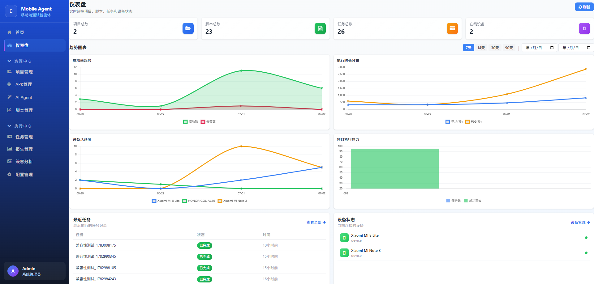
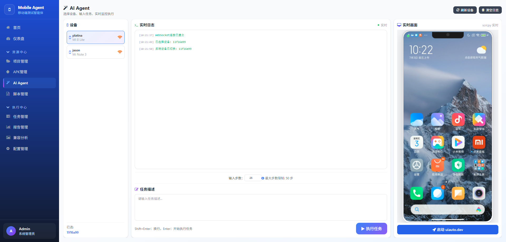
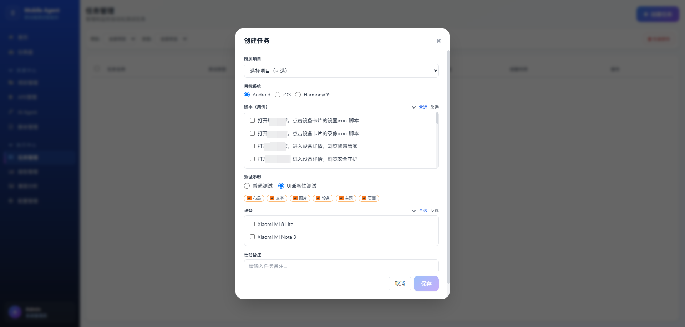
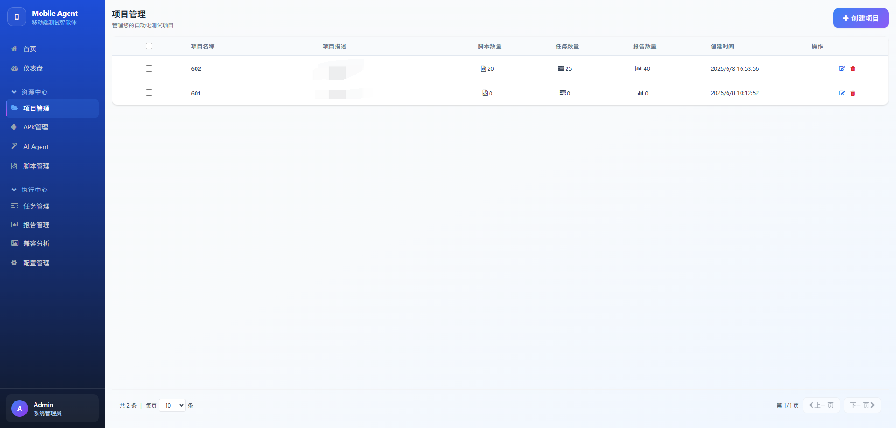
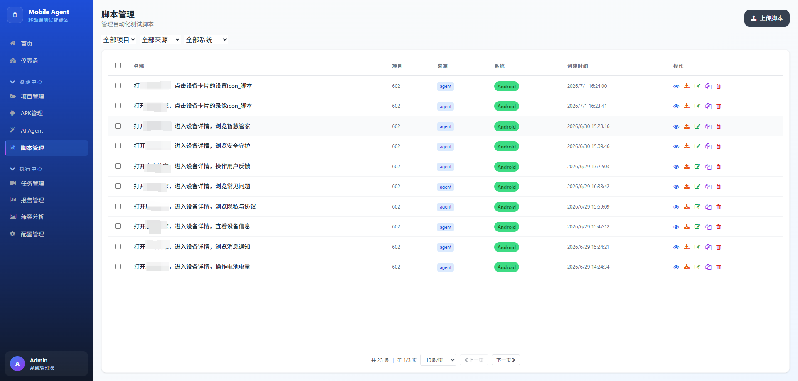
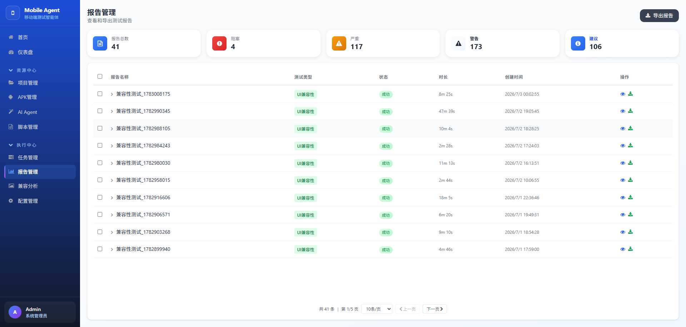
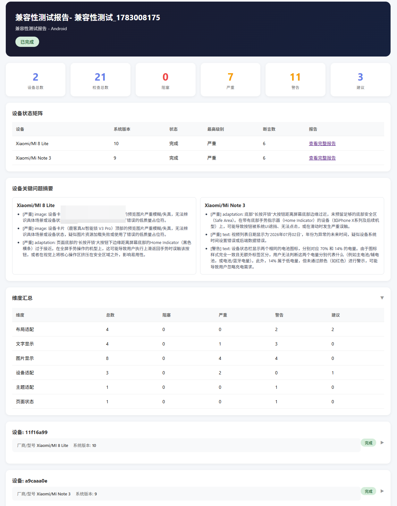
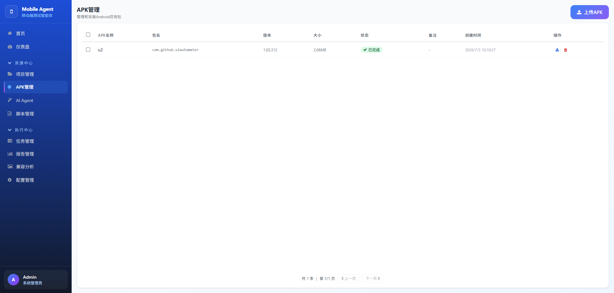
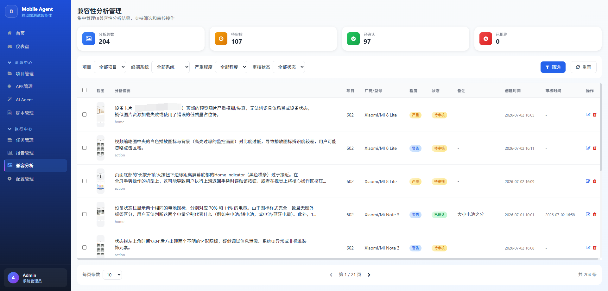
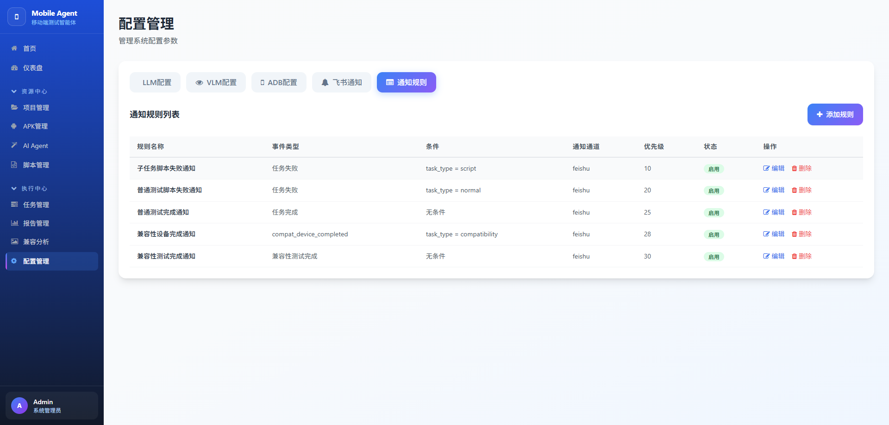

# Mobile Agent

> **基于 ReAct Agent 的移动设备智能自动化平台** — 用自然语言指挥你的手机

Mobile Agent 的核心是一个 **ReAct（Reasoning + Acting）循环引擎**：用户输入自然语言指令 → LLM 推理拆解为步骤 → 调用 MCP 设备工具（ADB/HDC/WDA）执行操作 → 观察屏幕结果 → 继续推理直到任务完成。整个过程由三层记忆系统（工作记忆、短期记忆、长期记忆）支撑经验积累，配合反思学习机制持续优化执行质量。

**技术栈**：Python + FastAPI + Jinja2 + SQLite，纯文本 LLM 驱动（支持 OpenAI / Anthropic 协议），无前端框架。

<p align="center">
  
</p>

***

## 功能介绍

### Agent 控制台

| 页面                                                   | 说明                                            |
| ---------------------------------------------------- | --------------------------------------------- |
|         | **Agent 控制台** — 输入自然语言任务，实时查看 ReAct 推理过程和执行日志 |
|  | **创建任务** — 支持脚本任务和自然语言任务双模式                   |

核心能力：

- **ReAct Agent** — 推理-行动循环：LLM 思考 → 调用 MCP 设备工具 → 观察结果 → 继续推理，直至任务完成
- **TaskAnalyzer** — LLM 任务分类器，自动判断任务是否在 Agent 能力范围内
- **PerceptionEngine** — 感知引擎，分析执行结果、检测页面变化、判断目标达成状态
- **TaskStateTracker** — 里程碑/子任务跟踪，支持循环检测与恢复
- **ReactiveReflexor** — 实时反思组件，每一步后评估成功率并增量学习
- **ReflectionLoop** — 任务后反思：评估 → 根因分析 → 知识蒸馏 → 写入三层记忆
- **脚本生成器** — 从执行步骤自动生成可复用的 pytest 脚本

### 项目管理

<p align="center">
  
</p>

- 创建、编辑、删除项目
- 卡片化展示，直观管理项目关联的脚本和任务
- 项目统计（脚本数、任务数）

### 脚本管理

<p align="center">
  
</p>

- 在线编写和编辑测试脚本
- 版本管理，脚本搜索
- 一键执行脚本，支持批量操作

### 任务管理 & 报告

<p align="center">
  
  
</p>

- 任务创建（脚本任务 / 自然语言任务）
- 实时状态追踪（pending / running / finished / failed）
- 详细 HTML 任务执行报告
- 兼容性测试：多设备并行执行 + VLM 视觉断言

### APK 管理

<p align="center">
  
</p>

- 大文件分块上传
- 一键安装 APK 到设备
- 批量删除，安装状态实时显示

### 兼容性分析

<p align="center">
  
</p>

- 多设备并行测试
- VLM 视觉 UI 断言
- 基线管理

### 配置管理

<p align="center">
  
</p>

- LLM / VLM 模型配置（支持 OpenAI 和 Anthropic 协议）
- ADB 连接参数配置
- 配置持久化到数据库

***

## 技术架构

### 系统总览

```
┌─────────────────────────────────────────────────────────┐
│                      Web UI (FastAPI)                    │
│  ┌───────────┐ ┌──────────┐ ┌──────────┐ ┌──────────┐  │
│  │ Jinja2    │ │ REST API │ │WebSocket │ │ Static   │  │
│  │ Templates │ │ Routes   │ │ 实时通信  │ │ JS/CSS   │  │
│  └───────────┘ └──────────┘ └──────────┘ └──────────┘  │
└──────────────────────┬──────────────────────────────────┘
                       │
┌──────────────────────▼──────────────────────────────────┐
│                     Backend Core                         │
│                                                          │
│  ┌─────────┐ ┌──────────┐ ┌──────────┐ ┌────────────┐  │
│  │ ReAct   │ │ LLM      │ │ MCP      │ │ Reflection │  │
│  │ Agent   │ │ Protocol  │ │ Device   │ │ 反思学习    │  │
│  │ 引擎     │ │ 适配层    │ │ 抽象层    │ │ 系统       │  │
│  └─────────┘ └──────────┘ └──────────┘ └────────────┘  │
│                                                          │
│  ┌──────────┐ ┌──────────────┐ ┌───────────────────┐    │
│  │ Memory   │ │ Compatibility │ │ Notification      │    │
│  │ 记忆系统  │ │ 兼容性测试    │ │ 通知系统           │    │
│  └──────────┘ └──────────────┘ └───────────────────┘    │
│                                                          │
│  ┌──────────────────────────────────────────────────┐    │
│  │               Database (SQLite)                   │    │
│  │  projects / scripts / tasks / configs ...         │    │
│  └──────────────────────────────────────────────────┘    │
└──────────────────────┬──────────────────────────────────┘
                       │
┌──────────────────────▼──────────────────────────────────┐
│                   Device Layer (MCP)                     │
│  ┌──────────┐ ┌──────────┐ ┌──────────┐ ┌──────────┐  │
│  │ ADB      │ │ HDC      │ │ WDA      │ │ Scrcpy   │  │
│  │ Android  │ │HarmonyOS │ │ iOS      │ │ 屏幕投射  │  │
│  └──────────┘ └──────────┘ └──────────┘ └──────────┘  │
└─────────────────────────────────────────────────────────┘
```

### 后端 (`backend/`)

| 层            | 模块               | 技术方案                                                                                                |
| ------------ | ---------------- | --------------------------------------------------------------------------------------------------- |
| **Agent 引擎** | `agent/`         | ReActAgent — 推理-行动循环驱动；AgentManager — 全局调度；TaskAnalyzer — LLM 任务分类；PerceptionEngine — 结果感知          |
| **LLM 接入**   | `llm/`           | `LLMProtocol` 抽象基类 → `OpenAIProtocol` / `AnthropicProtocol` 双协议适配；`ReActAgentLLMClient` 封装消息格式与工具调用 |
| **设备抽象**     | `mcp/`           | `MCPToolsBase` 统一接口 → `ADBMCTools` / `MCPToolsHDC` / `MCPToolsWDA` 三平台实现；`MCPHub` 全局注册中心            |
| **数据库**      | `db/`            | SQLite + WAL 模式；线程安全单例；**纯 SQL 无 ORM**，覆盖全部业务                                                       |
| **记忆系统**     | `memory/`        | 三层架构：`WorkingMemory`（内存）→ `ShortTermMemory`（SQLite）→ `LongTermMemory`（JSON）；`MemoryManager` 统一编排    |
| **反思学习**     | `reflection/`    | `ReflectionLoop`：评估 → 根因分析 → 知识蒸馏 → 持久化；`ReactiveReflexor`：任务中实时评估+增量学习+失败预测                        |
| **兼容性测试**    | `compatibility/` | 多设备并行 + VLM 视觉断言 + 基线管理 + 报告生成                                                                      |
| **屏幕投射**     | `scrcpy/`        | scrcpy-server H264 流解析，WebSocket 推送实时画面                                                             |
| **通知系统**     | `notification/`  | 事件驱动 + 规则引擎 → 飞书 / 钉钉 / 邮件 / 企业微信                                                                   |
| **工具层**      | `utils/`         | 脚本生成器 / Python 沙箱执行 / Function Calling 工具定义 / 系统提示词                                                 |

#### Agent 执行流程

```
用户输入自然语言任务
       │
       ▼
┌────────────────┐
│  TaskAnalyzer  │ ← LLM 判断任务是否可执行
│  任务分类       │
└───────┬────────┘
       │ 可执行
       ▼
┌───────────────────┐
│    ReActAgent     │
│    推理-行动循环    │
│                    │   循环：LLM 思考 → 工具调用 → MCP 执行
│  ┌───────────┐   │   → 感知观察 → 记忆记录 → 反思评估
│  │ Think →   │   │
│  │ Act →     │   │   → 继续或完成
│  │ Observe   │   │
│  └───────────┘   │
└────────┬──────────┘
         │ 任务完成
         ▼
┌──────────────────────────────────┐
│ ReflectionLoop                   │
│ 评估 → 根因分析 → 知识蒸馏        │
│ → 写入 ShortTerm / LongTerm 记忆  │
└──────────────────────────────────┘
```

### 前端 (`web_ui/`)

| 方面       | 技术方案                                                                                                                                     |
| -------- | ---------------------------------------------------------------------------------------------------------------------------------------- |
| **框架**   | **FastAPI** — 轻量入口，14 个路由模块（`web_ui/routes/`）                                                                                        |
| **模板**   | **Jinja2** — HTML 模板 + TailwindCSS 设计系统                                                                                             |
| **前端逻辑** | **Vanilla JS** — 无前端框架，原生 JavaScript                                                                                                     |
| **实时通信** | **WebSocket** — Agent 日志流、Scrcpy 视频流、兼容性测试事件                                                                                             |
| **路由模块** | pages / dashboard / projects / scripts / tasks / devices / apks / reports / configs / settings / compatibility / uiauto\_dev / websocket |

### 设备控制

| 平台        | 协议                               | 实现                          |
| --------- | -------------------------------- | --------------------------- |
| Android   | ADB (Android Debug Bridge)       | `ADBMCTools` — 2000+ 行，全面覆盖 |
| HarmonyOS | HDC (HarmonyOS Device Connector) | `MCPToolsHDC`               |
| iOS       | WebDriverAgent (WDA)             | `MCPToolsWDA`               |
| 屏幕投射      | Scrcpy                           | H264 实时视频流（WebSocket）       |

***

## 快速开始

### 环境要求

- **Python** 3.10+（推荐 3.13）
- **ADB** — [Android Platform Tools](https://developer.android.com/tools/releases/platform-tools)
- **HDC** — HarmonyOS Device Connector（可选）
- **Xcode + WebDriverAgent** — iOS 设备（可选）

### 安装

```bash
git clone <repo-url>
cd Mobile_Agent

python -m venv venv
# Windows: venv\Scripts\activate
# Linux/Mac: source venv/bin/activate

pip install -r requirements.txt
```

### 启动

```bash
# Web UI（推荐）
python web_ui/main.py

# 自定义端口
python web_ui/main.py --port 9000
```

访问 `http://localhost:8001`

***

## 开发命令

```bash
ruff check . --select I    # import 排序
ruff check .               # 完整 lint
ruff format .              # 格式化
pytest . -x -v             # 全部测试
```

## 许可证

MIT License

## 免责声明

本项目仅用于**学习交流与开源分享**，旨在为移动端自动化技术研究提供参考。

**禁止**将本项目或其衍生产品用于任何商业用途、付费服务、企业级部署或任何形式的商业分发。使用者应遵守相关法律法规，对使用本软件产生的所有后果自行承担责任。作者不对因使用本软件而导致的任何直接或间接损失负责。

如需商业合作，请通过 Issue 联系作者。
